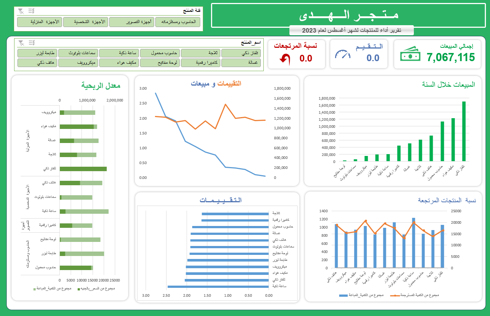

# Al Huda Store Performance Data Analysis   📊

## Project Objective
The “Al Huda Store Data Analysis” project aims to provide a comprehensive analysis of sales performance during 2023, with a focus on the month of August. The project is based on real data including sales details, ratings, products, and categories. This project is designed to provide insights that help make strategic decisions to improve performance, such as identifying best-selling products, understanding customer behavior, and analyzing sales-related ratings.

## During this project, we can answer several key questions:
1- What are the most profitable and best-selling products?

2- How do customer reviews affect sales?

3- What is the percentage of returned products and how does it affect overall performance?

4- What are the time patterns of sales during the year?

## Dataset used
- [Dataset](https://github.com/Abdulrahman-hussen/Data-analysis-of-Al-Huda-Store-performance/blob/main/(dataset)Al%20Huda.csv)

## Project Report
- We prepared a detailed report containing:
- Analysis of key questions about store performance.
- Detailed notes for each chart (e.g. total sales, best-selling products).
- Practical suggestions and solutions to improve store performance based on the data.
  
📄 View the full report format PDF:   [reports/Hda-Store-Analysis-Report.pdf](https://github.com/Abdulrahman-hussen/Data-analysis-of-Al-Huda-Store-performance/blob/main/(%20%20Report%20%20)Al%20Huda%20Store%20Performance%20Data%20Analysis.pdf)  

## Interactive Dashboard
We created a dashboard that displays store performance interactively.
### Key Points:
- Total sales, ratings, return percentage.
- Charts showing best-selling products and analysis of different categories.

